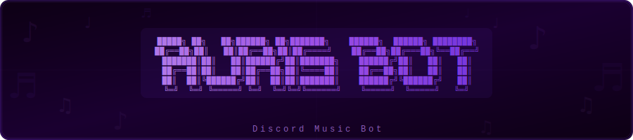

<div align="center">



<br/>

**v1.0.0**

<br/>


<br/>

[](LICENSE)
[]()

Bot de música para Discord construido con **.NET 8 y C#** — diseñado para uso privado y desarrollado como proyecto de portafolio.

> Diagramas de arquitectura y documentación técnica completa en [`docs/architecture.md`](docs/architecture.md)

</div>

---

## ¿Qué hace?

AurisBot se conecta a canales de voz de Discord y gestiona la reproducción de música de extremo a extremo — cola de canciones, controles de reproducción y streaming de audio, todo sin depender de bots externos ni dashboards de terceros.

- Se une y abandona canales de voz bajo demanda
- Agrega canciones desde YouTube mediante slash commands
- Soporta skip, pausa, reanudar y detener
- Muestra la cola actual en un embed de Discord
- Restringido a un único servidor autorizado

---

## Estructura del proyecto

```
AurisBot/
├── src/
│   └── AurisBot/
│       ├── Program.cs                  # Entry point, configuración DI
│       ├── Modules/
│       │   └── MusicModule.cs          # Slash commands: /play /skip /queue
│       ├── Services/
│       │   ├── AudioService.cs         # Lógica de cola, integración Lavalink
│       │   └── GuildGuardService.cs    # Restricción a un solo servidor
│       └── appsettings.json
├── docs/
│   ├── architecture.md                 # Diagramas y decisiones de diseño
│   └── diagrams/
│       └── aurisbot_banner.svg         # Banner del proyecto
├── .env.example
├── .gitignore
└── README.md
```

---

## Inicio rápido

**Requisitos previos:** .NET 8 SDK, token de bot de Discord, Lavalink corriendo local o remoto.

```bash
# 1. Clonar el repositorio
git clone https://github.com/tu-usuario/AurisBot.git
cd AurisBot

# 2. Copiar y configurar las variables de entorno
cp .env.example .env

# 3. Ejecutar
dotnet run --project src/AurisBot
```

**Variables de entorno requeridas** — ver `.env.example` para la lista completa:

```bash
DISCORD_TOKEN=        # Token del bot desde Discord Developer Portal
ALLOWED_GUILD_ID=     # ID de tu servidor — el bot abandona cualquier otro
LAVALINK_HOST=        # Host del servidor Lavalink
LAVALINK_PASSWORD=    # Contraseña del servidor Lavalink
```

---

## Comandos

| Comando | Descripción |
|---|---|
| `/play <búsqueda>` | Busca en YouTube y agrega a la cola |
| `/skip` | Salta la canción actual |
| `/pause` | Pausa la reproducción |
| `/resume` | Reanuda la reproducción |
| `/queue` | Muestra la cola actual |
| `/stop` | Detiene y desconecta el bot |

---

## Seguridad

El bot está bloqueado a un único servidor de Discord mediante `ALLOWED_GUILD_ID`. Si alguien lo invita a otro servidor, lo abandona de forma automática. Ningún token ni secreto está almacenado en el repositorio — toda la configuración sensible se inyecta mediante variables de entorno en tiempo de ejecución.

---

## Documentación

Documentación técnica completa — diagramas de arquitectura, decisiones de diseño y pipeline de CI/CD — disponible en [`docs/architecture.md`](docs/architecture.md).

---

<div align="center">

Desarrollado por [ChrisraaaLopez](https://github.com/ChrisraaaLopez)

</div>
