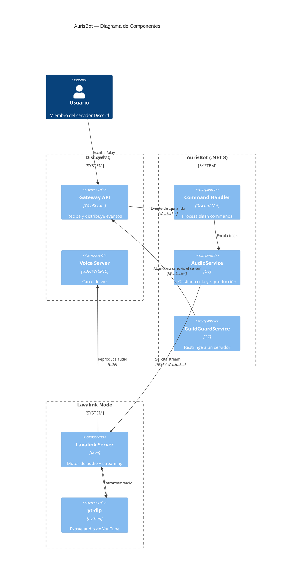

# Arquitectura — AurisBot

Documentación técnica completa del proyecto. Incluye decisiones de diseño, diagramas de componentes, flujo de comandos y configuración de despliegue.

---

## Índice

- [Arquitectura — AurisBot](#arquitectura--aurisbot)
  - [Índice](#índice)
  - [Stack tecnológico](#stack-tecnológico)
  - [Estructura real del proyecto (Excluyendo .gitignore)](#estructura-real-del-proyecto-excluyendo-gitignore)
  - [Diagrama de Componentes](#diagrama-de-componentes)
  - [Diagrama de Secuencia](#diagrama-de-secuencia)
  - [Seguridad](#seguridad)
  - [Despliegue](#despliegue)
  - [Decisiones de diseño](#decisiones-de-diseño)

---

## Stack tecnológico

| Capa | Tecnología | Motivo |
|---|---|---|
| Runtime | .NET 8 / C# | LTS estable, tipado fuerte, ideal para bots de larga ejecución |
| Librería Discord | Discord.Net | Librería madura con soporte completo de slash commands y voz |
| Motor de audio | Lavalink | Delega el procesamiento de audio a un nodo Java separado |
| Extracción de audio | yt-dlp | Sin API key, sin límites, extrae audio directo de YouTube |
| CI/CD | GitHub Actions | Build y validación automática en cada push |
| Hosting | Oracle Cloud | Soporte nativo para .NET, deploy desde GitHub |

---

## Estructura real del proyecto (Excluyendo .gitignore)

```
AurisBot/
├── AurisBot/
│   ├── Modules/
│   │   └── MusicModule.cs          # Slash commands: /play /skip /queue /pause /resume /stop
│   ├── Services/
│   │   ├── AudioService.cs         # Lógica de cola y reproducción
│   │   └── GuildGuardService.cs    # Restricción a un solo servidor
│   ├── Program.cs                  # Entry point, configuración DI
│   └── appsettings.json
├── docs/
│   ├── architecture.md
│   └── diagrams/
│       ├── aurisbot_banner.svg
│       ├── Componentes_C4_Nvl2.md
│       └── Secuencia_Comandos.md
├── .env.example
├── .gitignore
├── LICENSE
├── README.md
└── AurisBot.sln
```

---

## Diagrama de Componentes

Nivel 2 del modelo C4 — muestra los bloques principales del sistema y cómo se comunican entre sí.



---

## Diagrama de Secuencia

Flujo completo de todos los comandos disponibles.

```mermaid
sequenceDiagram
    autonumber
    actor U as Usuario
    participant D as Discord
    participant B as AurisBot (.NET 8)
    participant L as Lavalink
    participant Y as yt-dlp

    rect rgb(40, 20, 60)
        Note over U,Y: /play
        U->>D: /play <canción>
        D->>B: Evento SlashCommand (WebSocket)
        B->>B: Valida servidor (GuildGuardService)
        B->>B: Verifica canal de voz del usuario
        B->>L: Solicita búsqueda del track (REST)
        L->>Y: Busca y extrae audio de YouTube
        Y-->>L: URL de stream + metadata
        L-->>B: Track info (título, duración)
        B->>B: Agrega a la cola (AudioService)
        B->>D: Embed con título y duración
        D-->>U: ▶ Reproduciendo: [canción]
        B->>L: Conecta canal de voz y reproduce
        L->>D: Stream de audio (UDP)
        D-->>U: 🎵 Audio en canal de voz
    end

    rect rgb(20, 30, 60)
        Note over U,L: /skip
        U->>D: /skip
        D->>B: Evento SlashCommand
        B->>B: Verifica si hay cola activa
        B->>L: Salta track actual
        L-->>B: Confirmación
        B->>B: Carga siguiente track de la cola
        B->>D: Embed con nuevo track
        D-->>U: ⏭ Saltado — ahora: [canción]
    end

    rect rgb(20, 40, 40)
        Note over U,L: /pause
        U->>D: /pause
        D->>B: Evento SlashCommand
        B->>B: Verifica reproducción activa
        B->>L: Pausa stream
        L-->>B: Confirmación
        B->>D: Mensaje de confirmación
        D-->>U: ⏸ Reproducción pausada
    end

    rect rgb(20, 40, 40)
        Note over U,L: /resume
        U->>D: /resume
        D->>B: Evento SlashCommand
        B->>B: Verifica si está pausado
        B->>L: Reanuda stream
        L-->>B: Confirmación
        B->>D: Mensaje de confirmación
        D-->>U: ▶ Reproducción reanudada
    end

    rect rgb(30, 30, 20)
        Note over U,B: /queue
        U->>D: /queue
        D->>B: Evento SlashCommand
        B->>B: Lee cola actual (AudioService)
        B->>D: Embed con lista de tracks
        D-->>U: 🎶 Cola actual: [lista]
    end

    rect rgb(60, 20, 20)
        Note over U,L: /stop
        U->>D: /stop
        D->>B: Evento SlashCommand
        B->>L: Detiene reproducción
        B->>B: Limpia cola completa
        B->>L: Desconecta del canal de voz
        L-->>B: Confirmación
        B->>D: Mensaje de confirmación
        D-->>U: ⏹ Bot desconectado
    end
```



---

## Seguridad

El bot implementa dos capas de seguridad:

**Restricción de servidor** — Al arrancar, `GuildGuardService` verifica el `ALLOWED_GUILD_ID`. Si el bot es invitado a cualquier otro servidor, lo abandona de forma automática e inmediata.

**Secretos fuera del repositorio** — Ningún token, contraseña ni ID sensible está en el código. Todo se inyecta mediante variables de entorno en tiempo de ejecución.

```bash
DISCORD_TOKEN=        # Token del bot — Discord Developer Portal
ALLOWED_GUILD_ID=     # ID del servidor autorizado
LAVALINK_HOST=        # Host del servidor Lavalink
LAVALINK_PASSWORD=    # Contraseña del servidor Lavalink
```

---

## Despliegue

El bot se despliega en **Oracle Clud** (tier gratuito) conectado directamente al repositorio de GitHub.

**Flujo de CI/CD:**

```
Push a main
    → Proximamente...
```

---

## Decisiones de diseño

**¿Por qué Lavalink en lugar de procesar audio directo en .NET?**
Lavalink delega el procesamiento de audio a un nodo Java separado, lo que libera al bot de la carga de CPU del encoding. Es el estándar en bots de música de producción.

**¿Por qué yt-dlp en lugar de la API de YouTube?**
La API de YouTube tiene un límite de 10,000 requests diarios en el tier gratuito. yt-dlp extrae audio directamente sin API key, sin límites y sin costo.

**¿Por qué restringir a un solo servidor?**
El proyecto es de uso personal y portafolio. Restringir el bot a un servidor evita abusos si alguien encuentra el repositorio e intenta invitarlo a su propio servidor.

**¿Por qué migrar la infraestructura a Oracle Cloud (OCI) para un bot de música?**
Se optó por Oracle Cloud (OCI) debido a que el modelo IaaS (Always Free) ofrece recursos dedicados superiores (4 OCPUs ARM y 24GB de RAM), fundamentales para la estabilidad de Lavalink (Java), que consume memoria constante.
