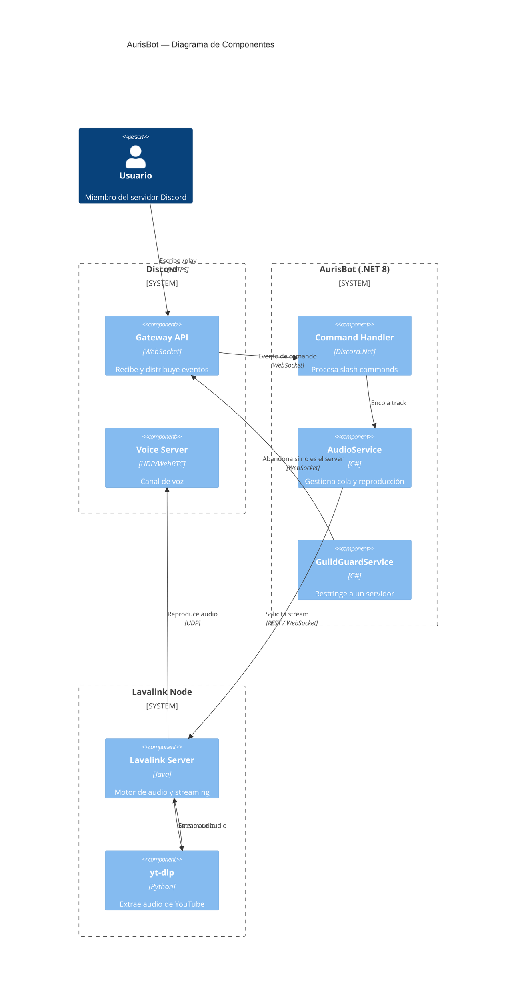

# Diagrama de Componentes (C4 - Nivel 2)

```mermaid
C4Component
    title AurisBot — Diagrama de Componentes

    Person(user, "Usuario", "Miembro del servidor Discord")

    System_Boundary(discord, "Discord") {
        Component(gateway, "Gateway API", "WebSocket", "Recibe y distribuye eventos")
        Component(voice, "Voice Server", "UDP/WebRTC", "Canal de voz")
    }

    System_Boundary(bot, "AurisBot (.NET 8)") {
        Component(handler, "Command Handler", "Discord.Net", "Procesa slash commands")
        Component(audio, "AudioService", "C#", "Gestiona cola y reproducción")
        Component(guard, "GuildGuardService", "C#", "Restringe a un servidor")
    }

    System_Boundary(lava, "Lavalink Node") {
        Component(lavalink, "Lavalink Server", "Java", "Motor de audio y streaming")
        Component(ytdlp, "yt-dlp", "Python", "Extrae audio de YouTube")
    }

    Rel(user, gateway, "Escribe /play", "HTTPS")
    Rel(gateway, handler, "Evento de comando", "WebSocket")
    Rel(handler, audio, "Encola track")
    Rel(audio, lavalink, "Solicita stream", "REST / WebSocket")
    Rel(lavalink, ytdlp, "Extrae audio")
    Rel(ytdlp, lavalink, "Stream de audio")
    Rel(lavalink, voice, "Reproduce audio", "UDP")
    Rel(guard, gateway, "Abandona si no es el server", "WebSocket")
```