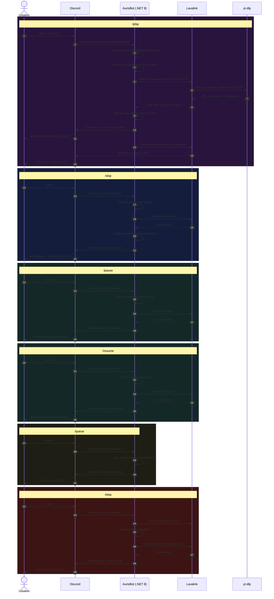

## Diagramas de Secuencia

```mermaid
sequenceDiagram
    autonumber
    actor U as Usuario
    participant D as Discord
    participant B as AurisBot (.NET 8)
    participant L as Lavalink
    participant Y as yt-dlp

    %% /play
    rect rgb(40, 20, 60)
        Note over U,Y: /play
        U->>D: /play <canción>
        D->>B: Evento SlashCommand (WebSocket)
        B->>B: Valida servidor (GuildGuardService)
        B->>B: Verifica canal de voz del usuario
        B->>L: Solicita búsqueda del track (REST)
        L->>Y: Busca y extrae audio de YouTube
        Y-->>L: URL de stream + metadata
        L-->>B: Track info (título, duración)
        B->>B: Agrega a la cola (AudioService)
        B->>D: Embed con título y duración
        D-->>U: ▶ Reproduciendo: [canción]
        B->>L: Conecta canal de voz y reproduce
        L->>D: Stream de audio (UDP)
        D-->>U: 🎵 Audio en canal de voz
    end

    %% /skip
    rect rgb(20, 30, 60)
        Note over U,L: /skip
        U->>D: /skip
        D->>B: Evento SlashCommand
        B->>B: Verifica si hay cola activa
        B->>L: Salta track actual
        L-->>B: Confirmación
        B->>B: Carga siguiente track de la cola
        B->>D: Embed con nuevo track
        D-->>U: ⏭ Saltado — ahora: [canción]
    end

    %% /pause
    rect rgb(20, 40, 40)
        Note over U,L: /pause
        U->>D: /pause
        D->>B: Evento SlashCommand
        B->>B: Verifica reproducción activa
        B->>L: Pausa stream
        L-->>B: Confirmación
        B->>D: Mensaje de confirmación
        D-->>U: ⏸ Reproducción pausada
    end

    %% /resume
    rect rgb(20, 40, 40)
        Note over U,L: /resume
        U->>D: /resume
        D->>B: Evento SlashCommand
        B->>B: Verifica si está pausado
        B->>L: Reanuda stream
        L-->>B: Confirmación
        B->>D: Mensaje de confirmación
        D-->>U: ▶ Reproducción reanudada
    end

    %% /queue
    rect rgb(30, 30, 20)
        Note over U,B: /queue
        U->>D: /queue
        D->>B: Evento SlashCommand
        B->>B: Lee cola actual (AudioService)
        B->>D: Embed con lista de tracks
        D-->>U: 🎶 Cola actual: [lista]
    end

    %% /stop
    rect rgb(60, 20, 20)
        Note over U,L: /stop
        U->>D: /stop
        D->>B: Evento SlashCommand
        B->>L: Detiene reproducción
        B->>B: Limpia cola completa
        B->>L: Desconecta del canal de voz
        L-->>B: Confirmación
        B->>D: Mensaje de confirmación
        D-->>U: ⏹ Bot desconectado
    end
```